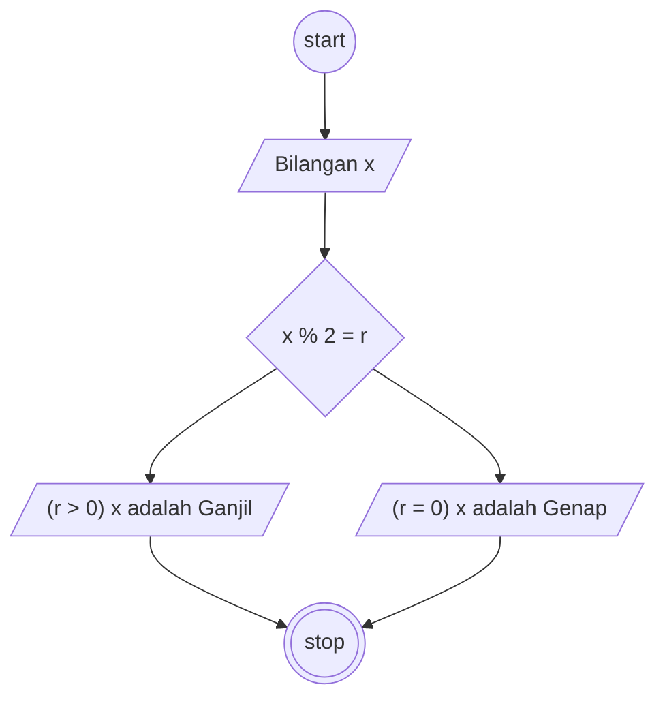

# Algoritma
## Menentukan angka ganjil dan genap

Algoritma ini ditulis untuk memecahkan masalah menentukan suatu bilangan ganjil atau genap.

1. Mulai
2. Siapkan bilangan (x)
3. Bilangan (x) jika dimoduluskan dengan 2 hasilnya 0 maka bilangan tersebut merupakan bilangan genap
4. Jika (x) dimoduluskan dengan 2 hasilnya lebih dari 0 maka bilangan tersebut bilangan ganjil
5. Selesai

## Flowchart

Sebuah Flowchart untuk memecahkan apakah bilangan merupakan ganjil atau genap.

