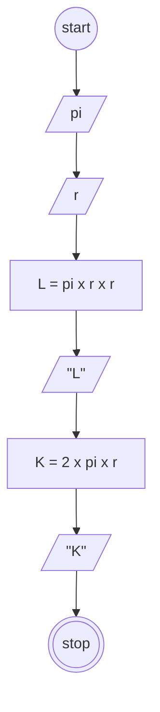

# Algoritma
## Luas dan keliling lingkarang

Algoritma ini ditulis untuk menghitung hasil luas dan keliling dari lingkarang

1. Mulai
2. Diketahui pi = 3.14
3. (r) jari-jari dari lingkaran
4. Mulai hitung luas, (pi x r) x r 
5. 3.14 x r x r =
6. Mulai hitung keliling, (2 x pi) x r
7. 6.28 x r =
8. Selesai

## Flowchart

Sebuah Flowchart untuk menentukan hasil dari luas dan keliling lingkaran.

