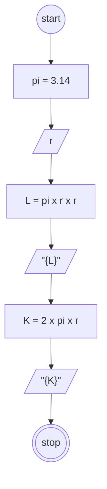

# Algoritma
## Luas dan keliling lingkarang

Algoritma ini ditulis untuk menghitung hasil luas dan keliling dari lingkaran

1. Mulai
2. Nilai pi adalah 3.14
3. Masukan nilai (r) yang merupakan nilai jari-jari lingkaran
4. Mulai hitung luas, (pi x r) x r
5. Tampilkan hasil luas
6. Mulai hitung keliling, (2 x pi) x r
7. Tampilkan hasil keliling
8. Selesai

## Flowchart

Flowchart ini dirancang untuk menentukan hasil dari luas dan keliling lingkaran.



```pseudo
CONSTANT pi = 3.14
DECLARE r: INTEGER
DECLARE L: INTEGER
DECLARE K: INTEGER

INPUT r

L <- pi * r * r
OUTPUT L
K <- 2 * pi * r
OUTPUT K

```