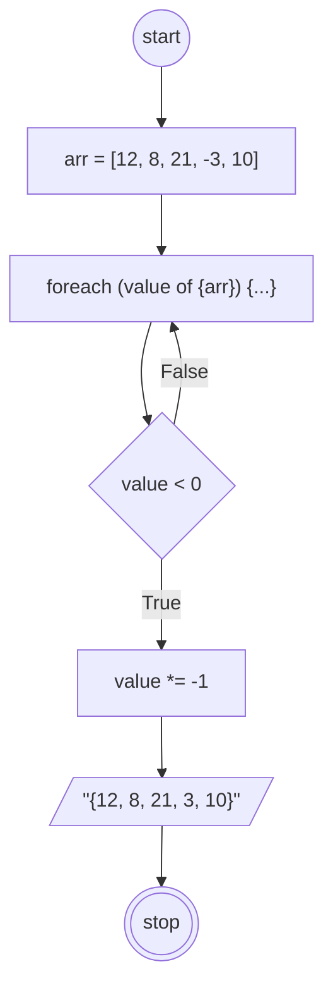

# Program yang akan dibuat

## Implementasi notasi Algoritma pada program ubah nilai negatif dalam array menjadi positif

## Deskriftif

Algoritma ini ditulis untuk mencari bilangan negatif pada sebuah array lalu membuatnya menjadi positif

1. Mulai
2. Siapkan array yang bertipe data integer yang berisi satu angka negatif
3. Lalukan perulangan pada setiap nilai array
4. Jika salah satu nilai dari array kurang dari 0 maka kalikan nilai tersebut dengan -1 (minus x minus) = positif
5. Outputkan data array yang baru
6. Selesai

## Flowchart

Flowchart ini dirancang untuk mencari bilangan negatif pada sebuah array lalu membuatnya menjadi positif



```pseudo
DECLARE arr: ARRAY [1:5] OF INTEGER
arr <- [12, 8, 21, -3, 10]

CONSTANT maxArr = LENGTH(arr)

FOR index <- 1 TO maxArr
    IF arr[index] < 0 THEN
        arr[index] <- arr[index] * -1
NEXT index

OUTPUT arr

```


